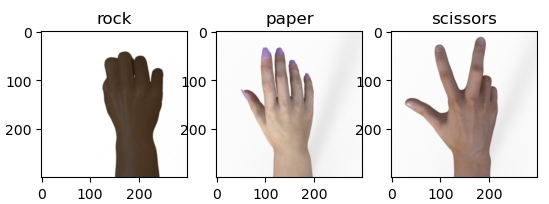
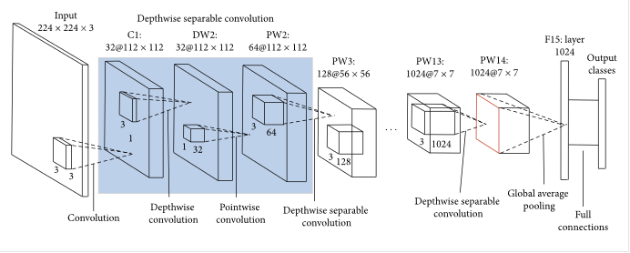
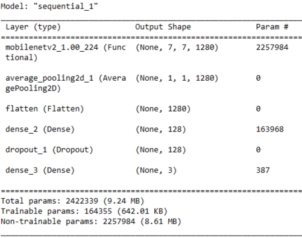
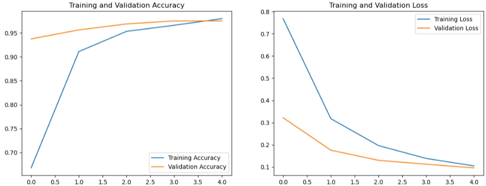
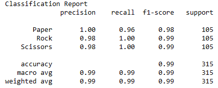
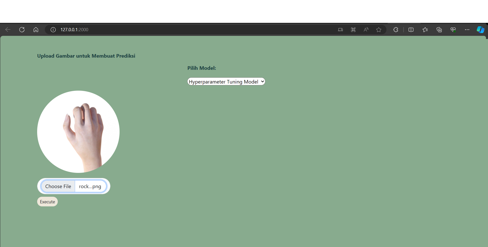
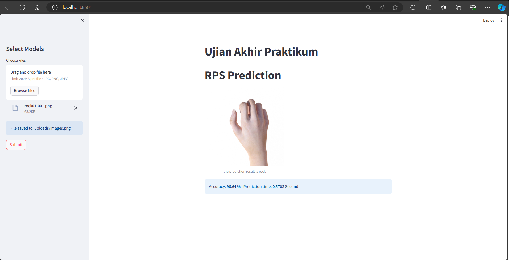

# ⚡️ RPS Images⚡️

## Overview Problems
Masalah yang ditemukan dari project ini yaitu bagaimana cara membuat model dengan akurasi yang baik dari dataset RPS yang telah diberikan.

## Overview Dataset
Dataset ini sudah tersedia pada link google drive yang dibagikan kepada praktikan, dataset dibagi menjadi 85% training, 15% validation. link url untuk download dataset: https://drive.google.com/drive/folders/16ugqhXnjkhJS6xmP3D_PA2_Mj-nTHQdD?usp=drive_link

## Preprocessing and Modeling
Pada bagian preprocessing data di rescale 1/255 lalu rotasi, zoom, shear, shift dengan masing-masing 20%, random flip

Untuk model kami menggunakan model _MobileNetV2_ dan ini adalah ilustrasi bagaimana _MobileNetV2_ bekerja

Summary Model:

Graph accuracy dan loss model:

Classifcation Report Model:

## Prediction and Deployment

Prediksi yang diambil yaitu 10 gambar acak dari testing dan melihat bagaimana model dapat memprediksi gambar dengan baik, berikut ini adalah hasilnya:

Deployment ini menggunakan streamlit dan dapat dilihat sebagai berikut :

